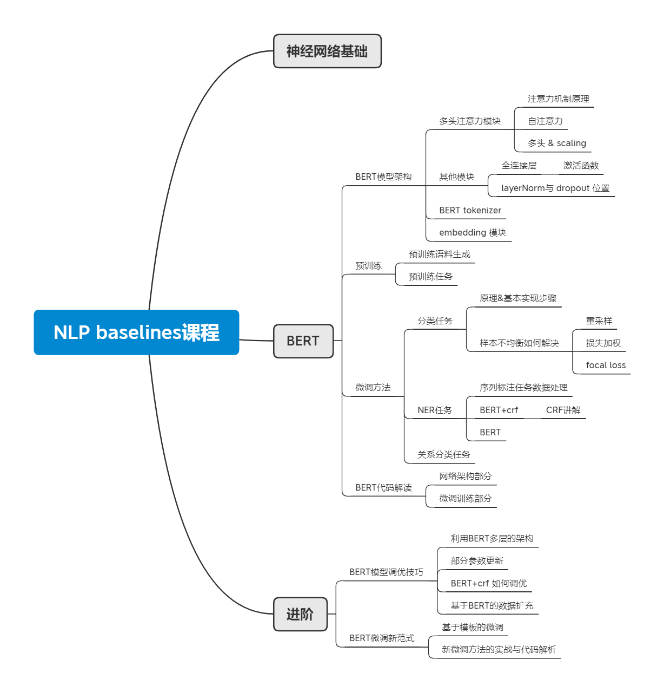

后BERT时代的所有榜单都是BERT或其变体占据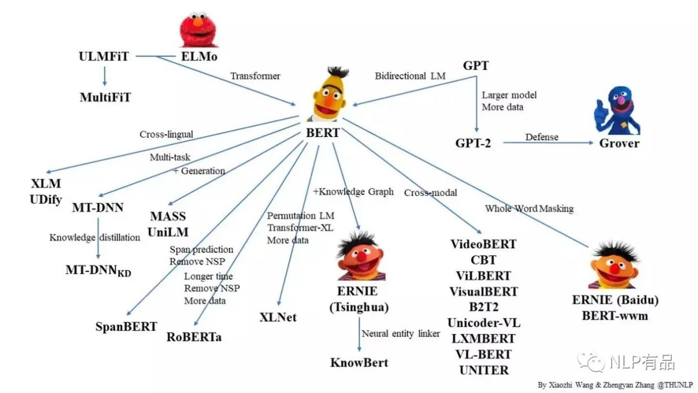

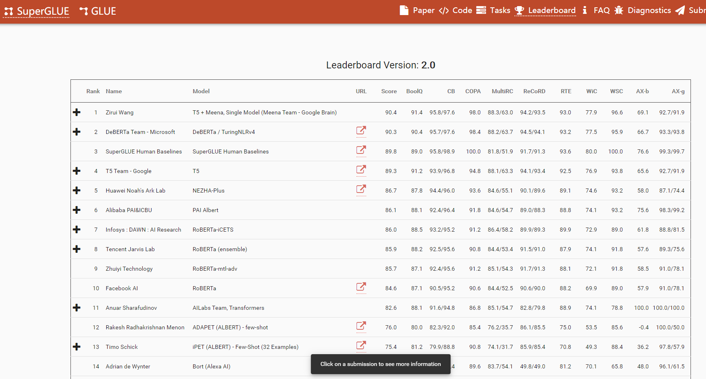

post BERT era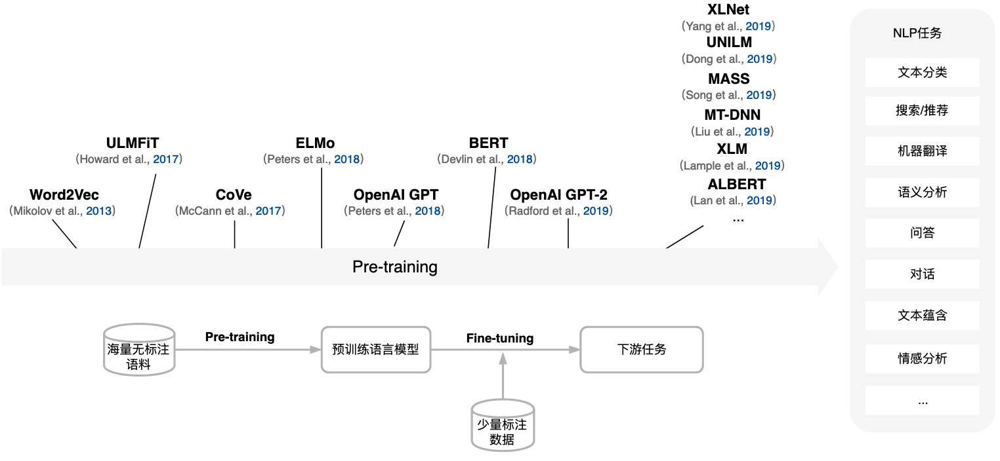

BERT网络结构:
·多层叫做transformer的网络叠加

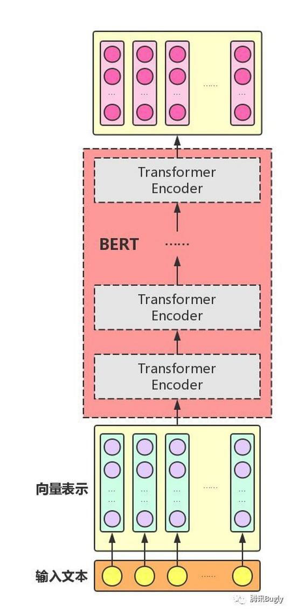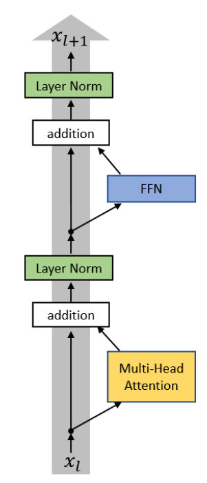

Transformer层的网络核心要素:
. Multi-head attention(多头注意力)
.FFN(全连接层)
. LayerNorm(层归一化)
·残差连接

### Attention
在深度学习领域的发展历程

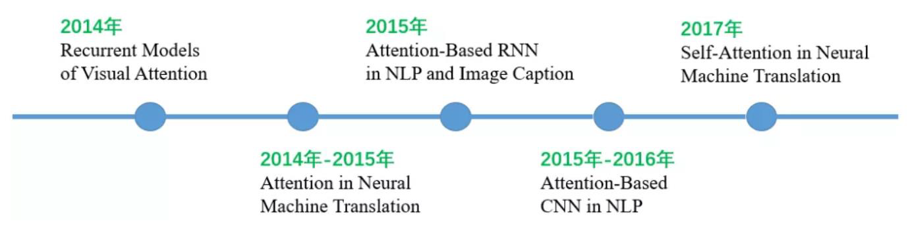

NMT model w/o attention
Seq2Seq   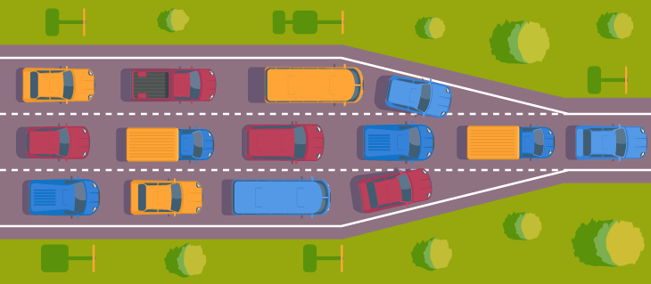

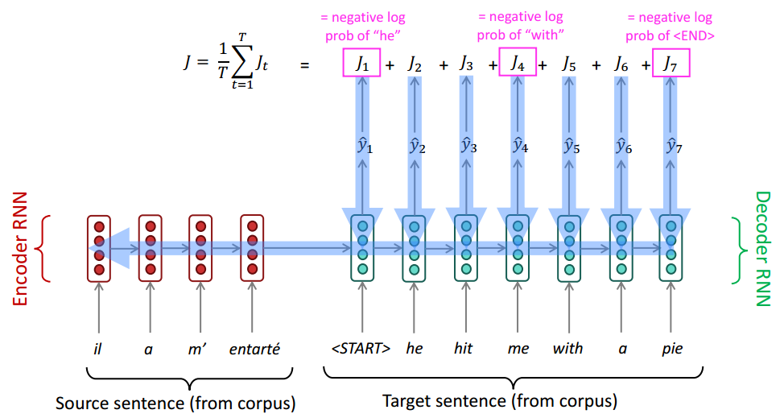

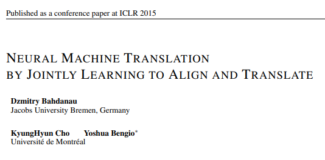

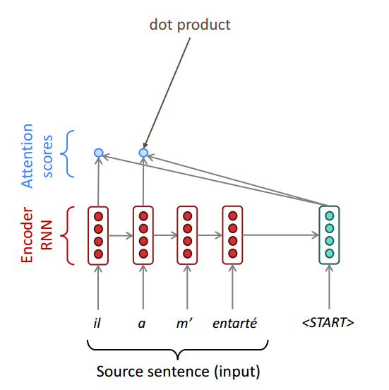

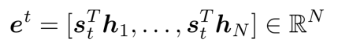

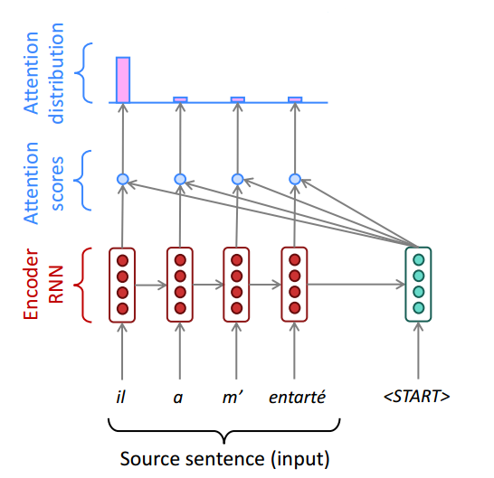

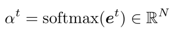

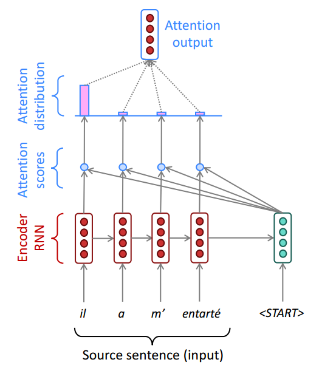

用注意力分布计算输入句子的加权平均表征at:
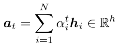

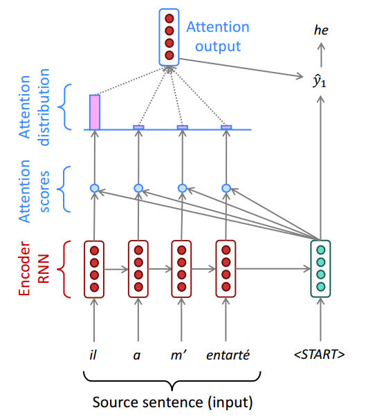

注意力输出与s,拼接帮助解码: 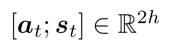

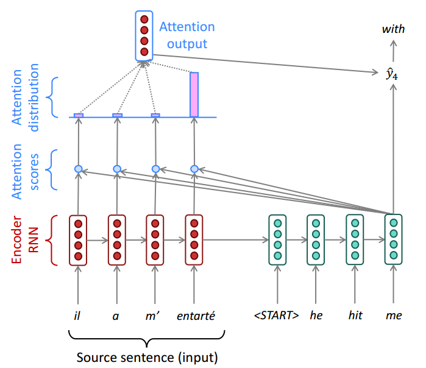

#### Attention

注意力的一般定义:
·给定一组向量(key, value)
键值对，以及一个向量query,注意力机制就是一种根据query与keys来计算values的加权平均的模块。

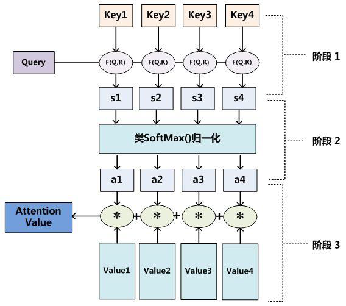

注意力的多种写法：

点积注意力(dot-product attention) :
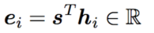

乘法注意力(multiplicative attention): 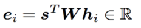

加法注意力(additive attention):  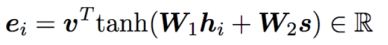

Attention建模句子表征
·从单个字角度:e.g.,“it_”的向量表征
与句子中的所有词之间计算注意力，由此更新其向量表征:

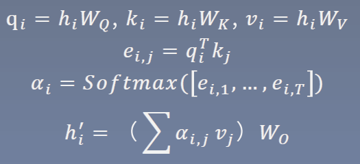

attention操作完全并行的使句子中词语两两间有了交互;

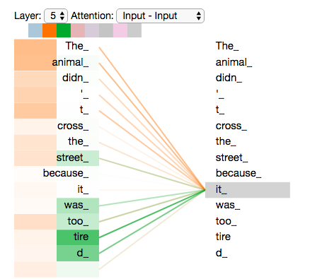

Attention建模句子表征
。整个句子的一次self-attention :句子的现有的表征记为H =[h1, ... , hT], 则:

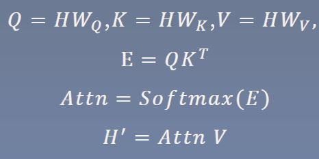

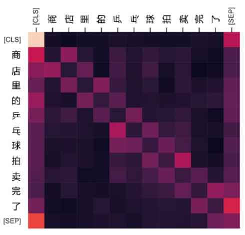

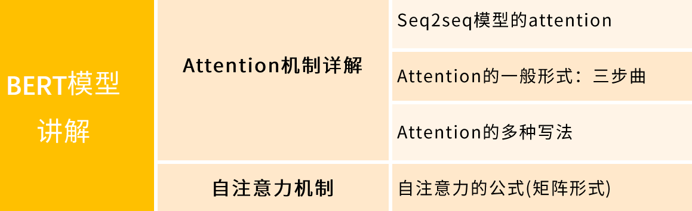