Bi-LSTM-CRF模型

BERT之前的最好的分类模型是以 LSTM为基础

Bi-LSTM-CRF模型

谷歌GNMT模型

RNN缺点

​	需要O(L)的复杂度使句子中所有词都有交互:长距离的语义依赖很难学到(vanishing gradients);
​	并行性不好:前向传播和后向传播都受到O(L)限制;

CNN模型

​	CNN模型很高效;
​	但是长距离的文本之间的依赖很难由CNN建模:需要非常多层CNN叠加;

句子顺序信息

位置编码：$p_i \in R^d, for i \in \{ 1,2, ... ,T\}$
位置编码加在哪里？加在Embedding层; 也可以每层都加
位置编码具体形式。
	正余弦位置编码
	学习驱动的位置编码:p; 随机初始化，同模型一起学习

加入全连接层：
注意这里的操作是单点的(pointwise): m_i只由output_i决定，而不接收句子中其他信息

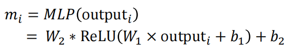

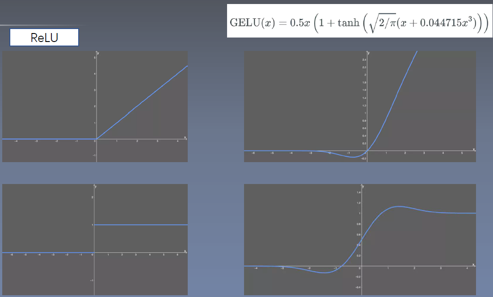

多头机制：

不同的head去关注不同上下文依赖：

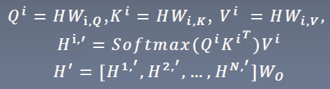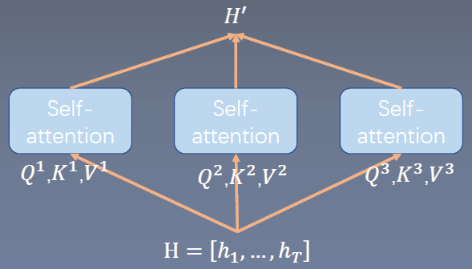

模型集成的效应(类似于谷歌lnception模型);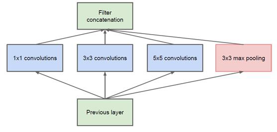

Scaled dot-product attention:
.在计算attention分数时候除去一个因子√d;: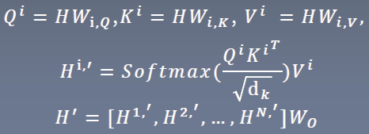

作用:模型维度较高的时候，向量点乘结果会比较大，这个时候由于经过了softmax，梯度会变小,训练会不稳定
你可以证明这个观点吗?

残差连接:
$H^(l+1) = H^l + layer(H^l)$

残差连接有什么意义?
解决深度网络的梯度消失问题(原文)
改变损失函数形状:使得损失函数更加平滑;

Layer Normalization:
层归一化:
对每个向量求其均值$\mu$和方差$\sigma$;

$\mathrm{x}^{\prime}=\frac{x-\mu}{\sqrt{\sigma}+\epsilon} * \gamma+\beta$

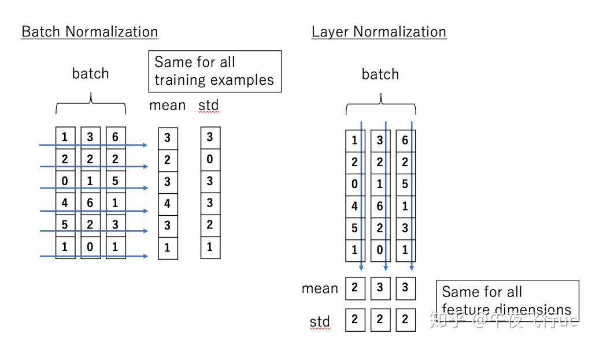

层归一化的意义:
。与残差连接的作用类似:损失函数landscape变得平滑了;[1]
。梯度的方差变小了;[2]

[1]Santurkar, S.Tsipras, D., lyas, A.,& Madry,A. (2018).How Does Batch Normalization Help Optimization? NeurIlPS.
[2] Xu, J., Sun, X., Zhang,Z., Zhao, G.,&. Lin,J.(2019).Understanding and improving layer normalization. arXiv preprintarXiv:1911.07013.

层归一化位置很重要:
.对于post-LN，最后一层的参数的梯度满足:

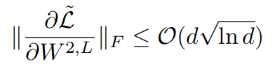

对于pre-LN，则为:
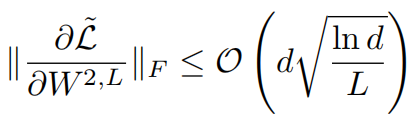

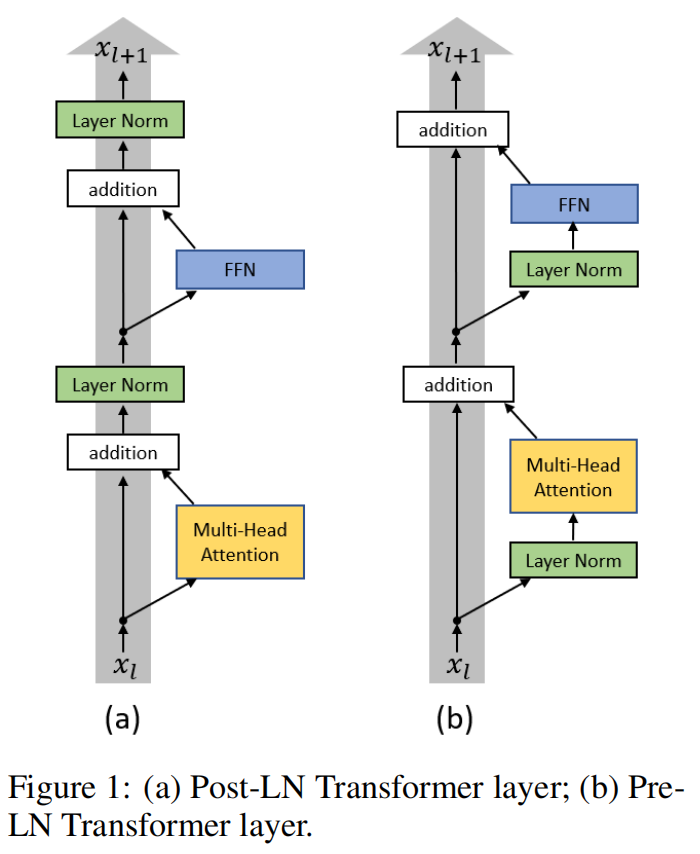

Xiong, R., Yang, Y., He, D., Zheng, K., Zheng, S., Xing, C.,Zhang, H., Lan, Y., Wang, L., & Liu, T.(2020). On LayerNormalization in the Transformer Architecture. ArXiv,abs2002.04745.

层归一化位置:
AutoTrans[1]提出采用自动机器学习的方法寻找layerNorm的最优位置组合;

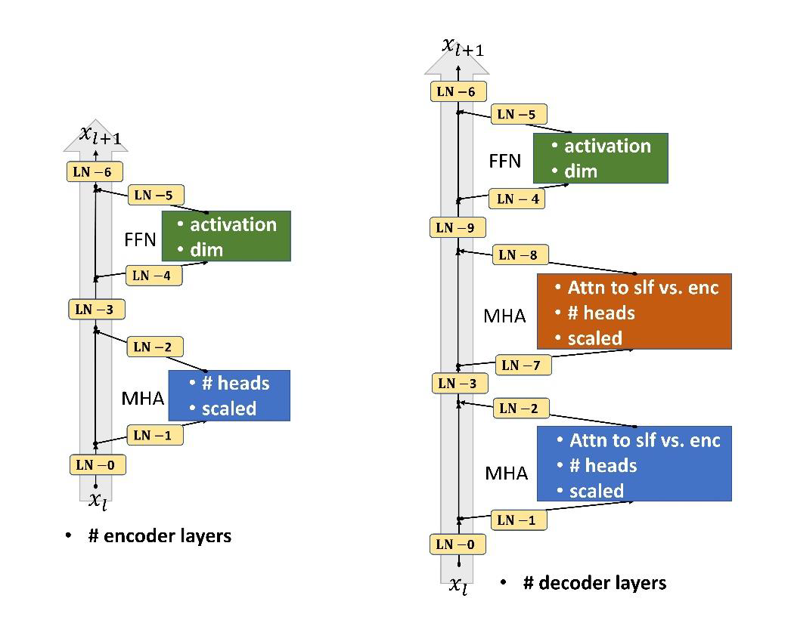

E.g.,在Mutli-30k上学到的新型transformer结构

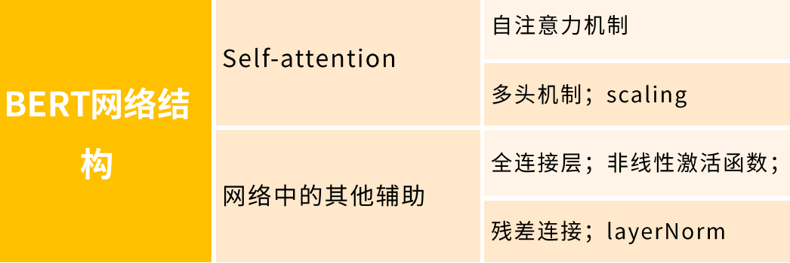