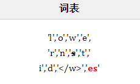

#### Word2Vec

Pre-BERT预训练:词向量
·词汇表V：每个单词对应一个编号$i\in V$ ，每个词i同时对应一个向量$v_i$ ;
·通过预测邻居词汇来训练:
. Skip-gram;
· CBOW;
. Skip-gram：正式的:如果$w(t)= i$，则$w(t +\Delta t)$
为单词 $j$ 的概率为:

$\mathrm{p}(\mathrm{w}(\boldsymbol{t}+\boldsymbol{\Delta} \boldsymbol{t})=\boldsymbol{j} \mid \mathrm{w}(\boldsymbol{t})=\boldsymbol{i})=\frac{\exp \left(v_{\boldsymbol{j}}^{T} v_{\boldsymbol{i}}\right)}{\sum_{k \in V} \exp \left(v_{k}^{T} v_{i}\right)}$

词向量局限性:
·固定的,无法表达上下文:
·蚂蚁马上要上市了!
·蚂蚁上树很好吃!
·蚂蚁是群居的。

2017年及以前，NLP模型的普遍形态:·
	词向量+encoder(如右图):
	LSTM或者Transformer模型通过训练集来学习如何提取上下文信息;
	·这样的模式有什么缺陷?
		.Encoder部分随机初始化，对优化器压力大;
		数据集要足够好，足够大，encoder才能学会如何提取上下文信息

#### BERT

我们现在想要有效的预训练embedding+编码器︰
	利用大量存在的无标签文本数据;
	无监督→自监督: 
**self-supervised learning**：the system learns to predict part of its input from other parts of it input. 
掩码预测任务:
(1）遮掩某个词(用”[MASK]" 字符替换原词);
(2)  句子输入BERT网络;
(3）预测这个词。

掩码预测任务:可能存在什么问题呢?
·我们下游任务，e.g.,预测一个句子的情感,是不会有[MASK]的;
在实现掩码预测任务的时候需要:
	遮掩的字只占语料全体的字数的一小部分(15%);
	在这15%里面:
		一部分被遮掩,也就是替换为[MASK];
		一部分随机替换为其他词(仍然需要预测此处的token应该是什么);
		一部分保留原词(仍然需要预测此处的token);

判断句子B是否是句子A的下文。
所以BERT句子的输入会是[CLS] A sent [SEP] B sent [SEP]的格式;

上下句关系保存在输入的[CLS]符号中，在预测时使用BertPooler提取整个输入序列的表征：
	这里要注意：不是直接拿[CLS]的向量表征；而是要经过BertPooler这个模块，其中包含MLP,tanh操作得到一个向量表示,再输入到2分类层;

#### Subword Tokenizer

举例:
句子”play the song little robin redbreast”在输入模型时变为”[CLS] play the song red fttbre #tast [SEP]"
为何要使用subword tokenizer:
·传统词表示方法：是先对各个句子进行分词，然后再统计并选出频数最高的前N个词组成词表·词表一般较大，一是尾部词训练不充分，二是显存占用较大
·传统词表示方法无法很好的处理未知或罕见的词汇（OOV问题)·传统词tokenization方法不利于模型学习词缀之间的关系
·E.g.模型学到的“old”, “older”,and“oldest”之间的关系无法泛化到“smart”, “smarter”, and “smartest”。
. Character embedding作为OOV的解决方法粒度太细，且推理时候显存开销较大:
	一个原本长度为12的句子，采用character embedding，则输入的大小变为12*16（假设设置词字母长度最大为16)
. Subword粒度在词与字符之间，能够较好的平衡OOV问题
常见的subword模型：Byte Pair Encoding (BPE), WordPiece

生成词表:
(1) 准备一个语料库;确定期望的Subword词表大小;
(2) 将单词拆分为成最小单元。比如英文中26个字母加上各种符号，这些作为初始词表;
(3) 在语料上统计单词内相邻单元对的频数，选取频数最高的单元对合并成新的Subword单元;
(4) 重复第3步直到:达到第1步设定的Subword词表大小或下一轮迭代中token最高频数为1.
右边举例说明:
假设现在语料库中有如下词汇(及其频率)∶·观察词汇表大小在每一步如何变化

Senrich,R., Haddow,B., &Birch,A.(2016).Neural Machine Translation of Rare Words with Subword Units. ArXiv, abs/1508.07909.

BPE算法 编码
得到Subword词表后，针对每一个单词，我们可以采用如下的方式来进行编码
	· 将词典中的所有子词按照长度由大到小进行排序;
	· 对于单词w，依次遍历排好序的词典。查看当前子词是否是该单词的子字符串(贪婪的最长匹
配)，如果是，则输出当前子词，并对剩余单词字符串继续匹配;
	· 如果遍历完字典后，仍不匹配，则将剩余字符串替换为特殊符号输出，如”<unk>”;

#### WordPiece算法

如何生成词表，以及如何处理文本
·生成词表的步骤与BPE类似;加上 ”##” 前缀表示token不作为一个完整单词的开始部分;
·与BPE的最大区别在于，如何选择两个子词进行合并∶BPE选择频数最高的相邻子词合并，而WordPiece选择能够提升语言模型概率最大的相邻子词加入词表;
	·假设假设句子S=(t,t.....tn)由n个子词组成，表示子词，且假设各个子词之间是独立存在的
	·句子的语言模型似然值等价于所有子词概率的乘积：$\log P(S)=\sum_{i=1}^{n} P\left(t_{i}\right)$
	·假设把相邻位置的i和j两个子词进行合并，合并后产生的子词记为z，此时句子似然值的变化可表示为：$\log P\left(t_{z}\right)-\left(\log P\left(t_{x}\right)+\log P\left(t_{y}\right)\right)=\log \frac{P\left(t_{z}\right)}{P\left(t_{x}\right) P\left(t_{y}\right)}$
	·很容易发现，似然值的变化就是两个子词之间的互信息。
简而言之，WordPiece每次选择合并的两个子词，他们具有最大的互信息值，也就是两子词在语言模型上具有较强的关联性，它们经常在语料中以相邻方式同时出现。

Schuse M l and KeisukeNalajima.“Japanese and korean woicesearch.”2012 (lCASSP)(212)..ArXiv,abs/1609.08144.

Wordpiece举例:
	·英文:采用BERT-base-uncased tokenizer
		·30522个单词;英文转化为小写
		·E.g.,句子“play the song little robin redbreast”经过BERT的wordpiece tokenizer后变为”['play', 'the', 'song', 'little', 'robin', 'red', ' ##bre', '##ast ‘]”;
·中文:采用Google Chinese BERT-base-uncased
	. 21128个单词;
	·不区分大小写;
	·中文汉字拆开(split_Chinese_character);
	·E.g,句子”我很喜欢一首歌: yesterday once more.”处理为['我,'很','喜','欢','一','首','歌',:','yes', '##ter', '##day', 'on', ##ce', 'more', .'];

Embedding Layer 嵌入层:
Token embedding
Segmentation embedding;
Position embedding;

谷歌在2018年开源了两个版本的英文BERT和一个版本的中文BERT:
·BERT-base: 12 layers, 768-dim hidden states, 12 attention heads,110 million params.
·BERT-large: 24 layers, 1024-dim hidden states,16 attention heads, 340 million params.
·中文BERT: BERT-base大小，词汇量21k;
预训练语料:
·英文模型:BooksCorpus (800 million words), English wikipedia (2,500 million words);
·中文维基百科:英文维基百科的十分之一;
预训练有多贵?
. 64 TPU chips for a total of 4 days.

微调相对很快!

