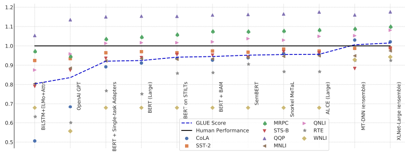

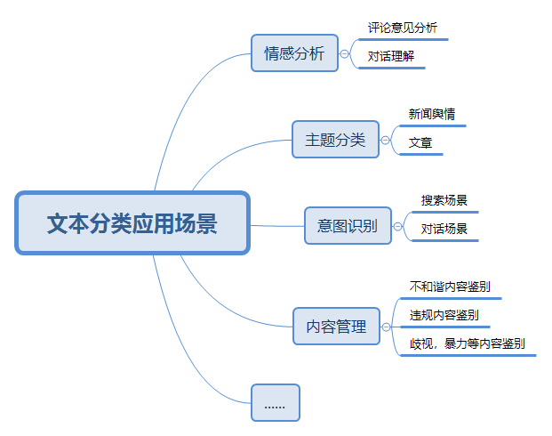

分类任务:
	.把文本按照—定的规则分门别类;
	·应用场景:
分类任务的微调:
·如何做?

分类任务:
·把文本按照一定的规则分门别类;
分类任务的微调:
如何做？与上下句预测基本一致。句子的输入是[CLS] A sent [SEP]。
句子的表征如何转化为一个向量?
·BertPooler：[CLS]的向量表征，经过MLP,
tanh操作得到一个向量表示，再输入到多分类层;
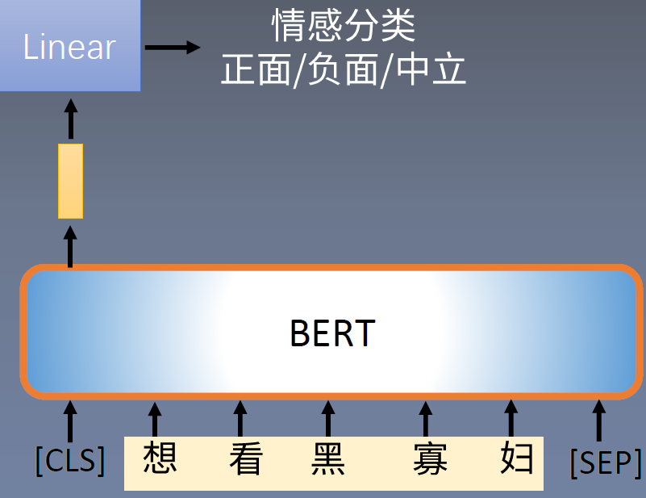

其他pooling操作;

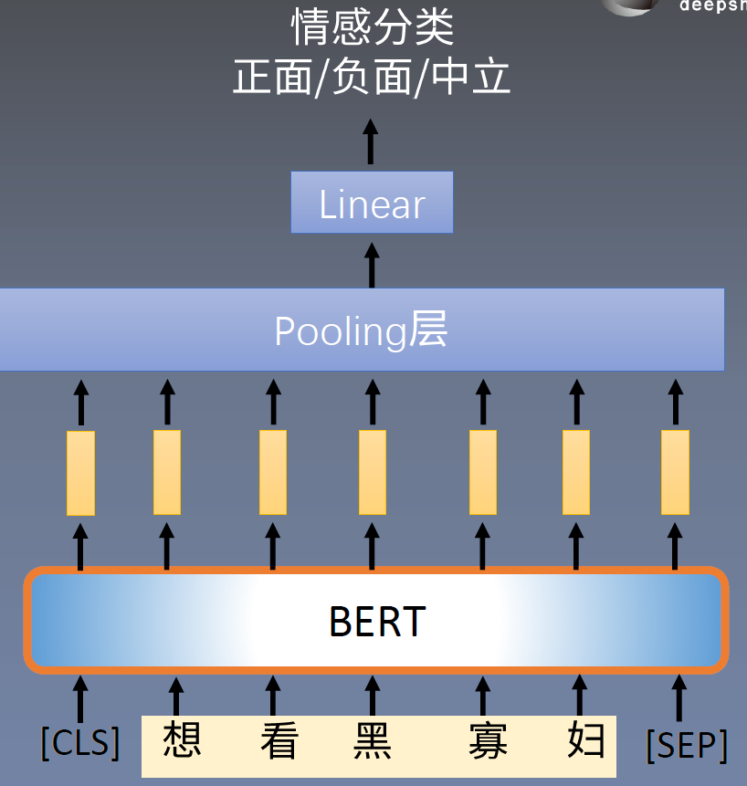

分类任务∶
句子对分类:
。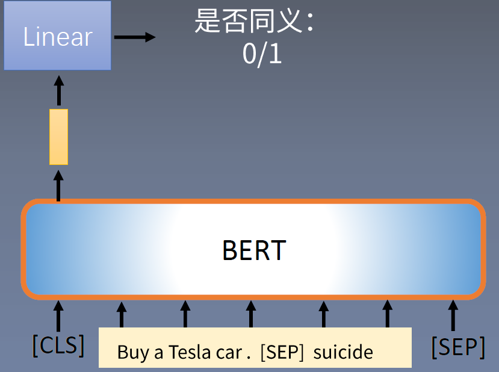

分类任务微调:·损失函数:
·假设模型对二分类训练样本(x,y)预测类别为c的概率为pc,则损失函数为
	$C E\left(p_{c}, x\right)=-\mathrm{I}(y=c) * \log \left(p_{c}\right)$
微调的原理与一般的网络训练没有区别;

分类任务微调:
BERT微调带来了巨大的红利;
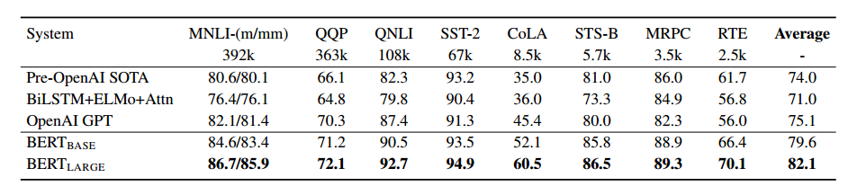

Sequence labeling
#### 序列标注任务:
·对于待标注的一段序列X=x_1， x_2，...,x_n}，我们需要给每个x_i预测一个tag;
·先定义Tag集合是T=t_1，t_2，...，t_m};
.中文分词:定义为{Begin,Middle，End，Single};
	·E.g.,风/B险/E基/B因/E 协/B同/E的/s神/B经/E生/B物/M学/E作/B用/E。
·命名实体识别:标出句子中的实体;使用BIO标注模式;实体类型包括{PER, ORG}
	·E.g.乔/B-PER布/I-PER斯/I-PER就/O职/O于/0苹/B-ORG 果/-ORG 公/I-ORG司/I-ORG ;
·词性标注（Part-of-speech, POS tagging) :标注出词语的词性;使用BIO标注模式;
	·E.g., jieba给出的:我/B-r在/B-p北/B-ns京/I-ns天/B-ns安/-ns门/I-ns

Sentence classification
序列标注任务:
·输入格式:[CLS] A sent [SEP]
。方法一:每个token的向量表示经过线性层+softmax;

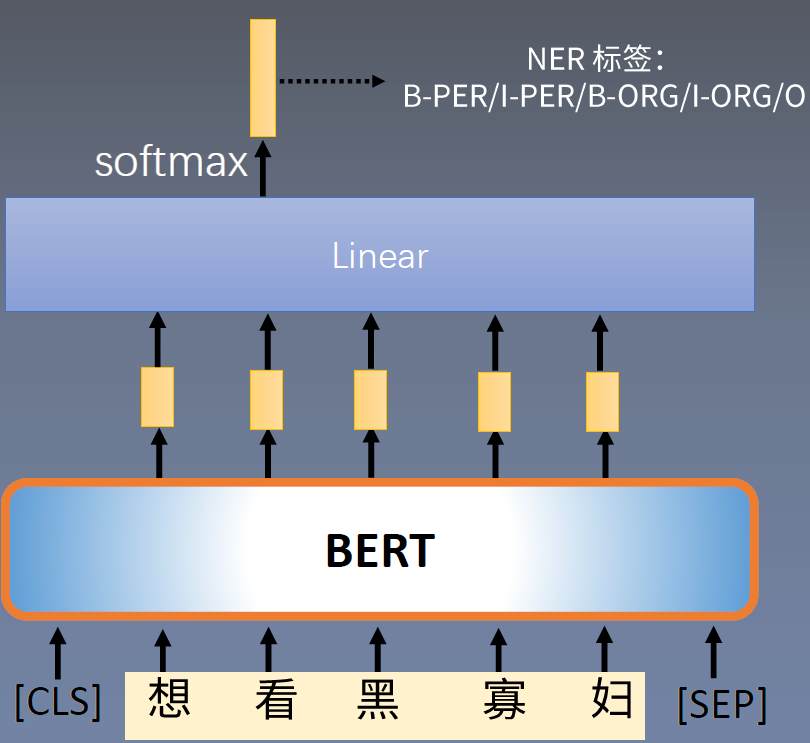

方法二:BERT+CRF层
.CRF层通过学习标签之间转移的模式，来规避“B-
PER，I-ORG”这样的问题;
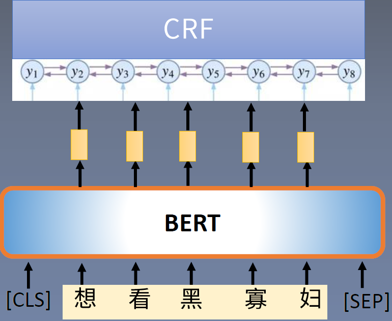

relation classification
#### 关系分类任务：
从非结构化文本中抽取出结构化知识；；具体为︰区分出头实体与尾实体之间的语义关系;
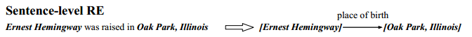

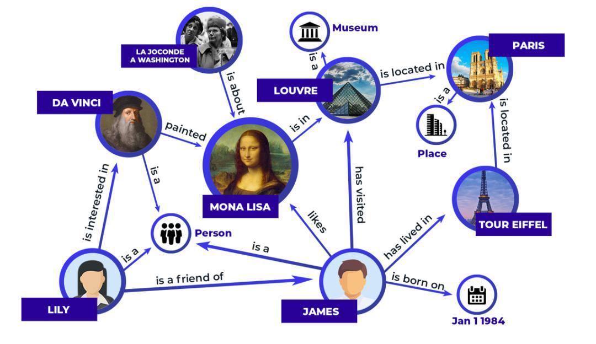

方法一:
.BERT表征句子;
·得到两个实体的向量表征:实体多个词的表征经过
pooling得到;
·头尾向量拼接，再经过线性层分类;
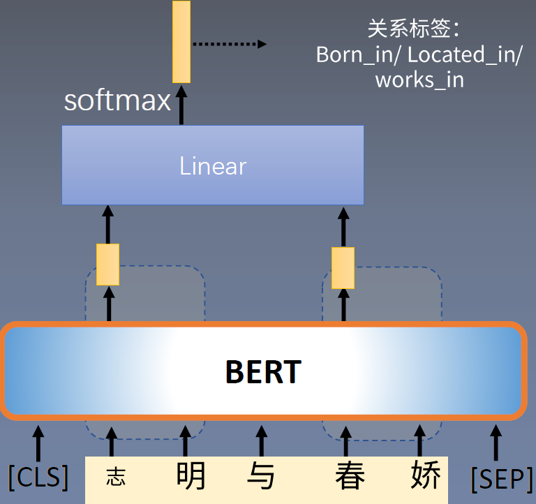

方法二:BERT的embedding层中加入关系位置编码

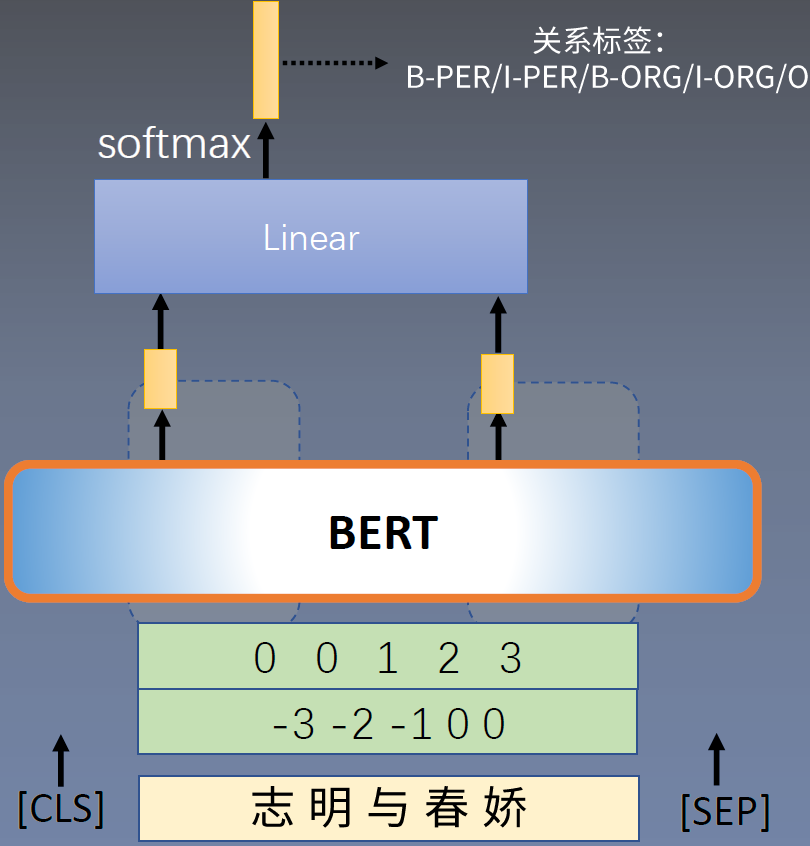

方法三:在句子中加入新定义的字符,标识出头尾实体位置;
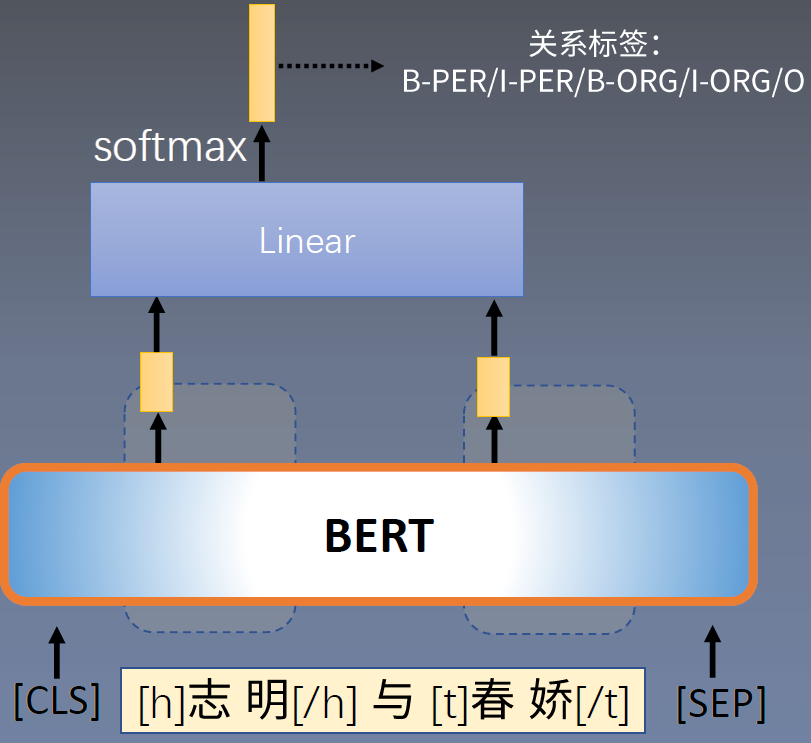

### BERT微调:样本不均衡问题
Sequence labeling task

样本不均衡场景:
Zipf’s law:在自然语言的语料库里，一个单词出现的频率与它在频率表里的排名成反比
二分类场景,正例出现次数少: e.g.,全员核酸检测中，阳性占比可以达到1:10000或者更小;

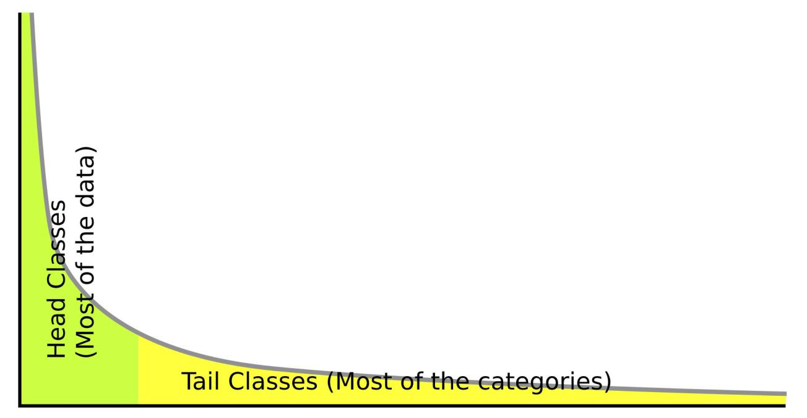

样本不均衡场景:
**重采样（re-sampling)**：假设C是数据集类别数，n,是类别 i 的样本数量，则从类别 i 中采样一个样本的概率:
. instance-balanced sampling:每个图片被等概率的抽到，即 $\mathbf{p}_{i}=\frac{n_{i}}{\sum_{j=1}^{C} n_{j}}$
Class balanced sampling:每个类别被抽到的概率都相等 $\mathrm{p}_{i}=\frac{1}{\sum_{j=1}^{C} 1}$
**重采样(re-sampling)**，假设q ∈(0,1), $\mathrm{p}_{i}=\frac{n_{i}^{q}}{\sum_{j=1}^{C} n_{j}^{q}}$

**重加权(re-weighting)**：以二分类为例,
·正常的交叉嫡损失:$C E\left(p_{c}, x\right)=-\mathrm{I}(y=c) * \log \left(p_{c}\right)$

通过增加一个系数,来控制少数类别的样本对总loss的贡献:
$C E\left(p_{c}, x\right)=-\alpha(c) * \mathrm{I}(y=c) * \log \left(p_{c}\right)$
添加的系数与难度相关:(思考:什么样的样本是困难的?)

**Focal loss:**
$C E\left(p_{c}, x\right)=-\left(1-p_{c}\right)^{\gamma} * \mathrm{I}(y=c) * \log \left(p_{c}\right)$
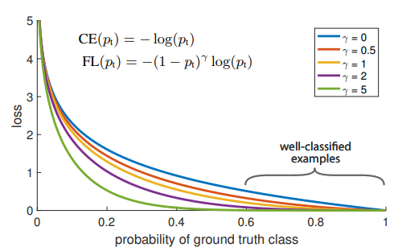

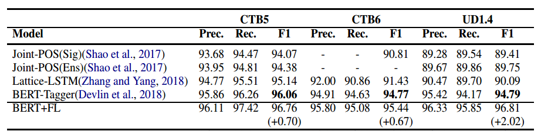
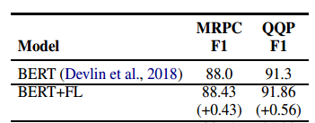

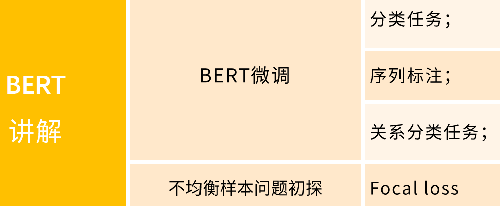