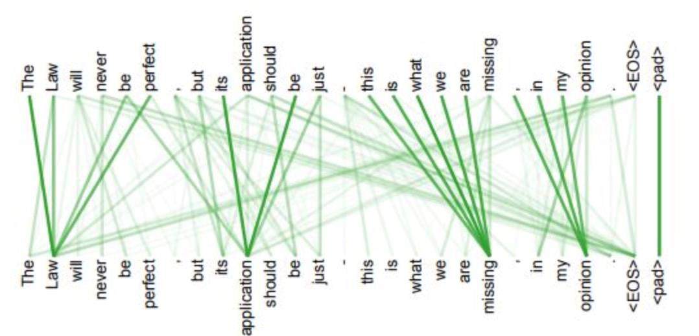
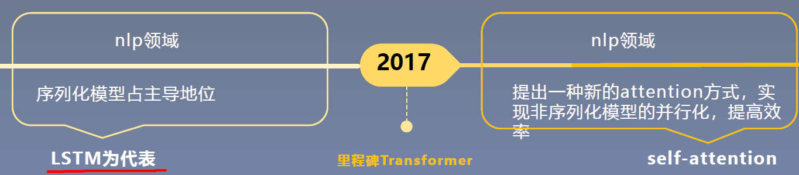
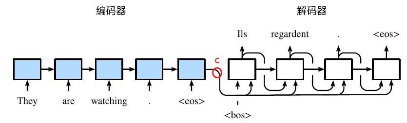

1在WMT 2014English-to-German翻译任务上比其它模型的bleu值高出两个点。
2时间复杂度上和传统模型相比大大降低，还可以用于并行。

3 self-attention模型具有更强的可解释性，左图attention结果显示了不同词语之间的关联信息。

Transformer历史意义
·提出self-attention，拉开了非序列化模型的序幕。
·为预训练模型的到来打下了坚实的基础

基于transformer结构的预训练模型:
bert(采用的transformer的encoder部分)
gpt(采用的transformer的decoder部分)
albert等tinybert模型。

Abstract  介绍背景及提出Transformer模型，在WMT翻译数据集上比最好模型的bleu值高出两个百分点
Introduction  提出序列化模型的弊端;并提出本文的模型
The Backgroud  传统卷积模型存在学习远距离依赖困难的弊端,并提出自注意力机制
Training  训练语料以及硬件、超参数设置介绍
Why Self-attention  分析self-attention和cnn、lstm的时间复杂度。
The Architecture  Transformer网络结构及其内部细节:Scaled Dot-Product Attention、Multi-Head Attention、Positional Encodina.
Results  Transformer的实验结果对比
Discussion  计划将transformer结构应用于除翻译外的其它领域

摘要核心
1.常用的序列模型都是基于卷积神经网络或者循环神经网络，表现最好的模型也是基于encoder-
decoder框架的基础加上attention机制。
2.提出一种基于attention机制的新模型transformer，抛弃了传统的模型结构。
3.模型在2014WMT翻译数据集上，比现存最好的模型的bleu值高2个点。

憧憬